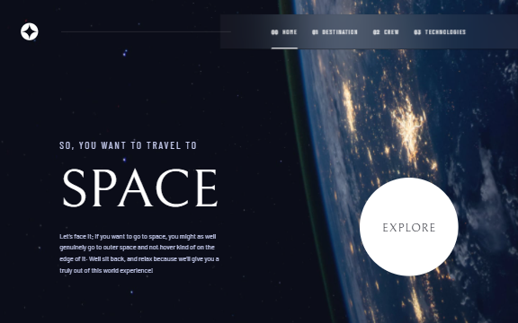
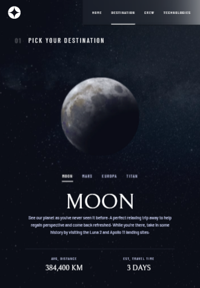
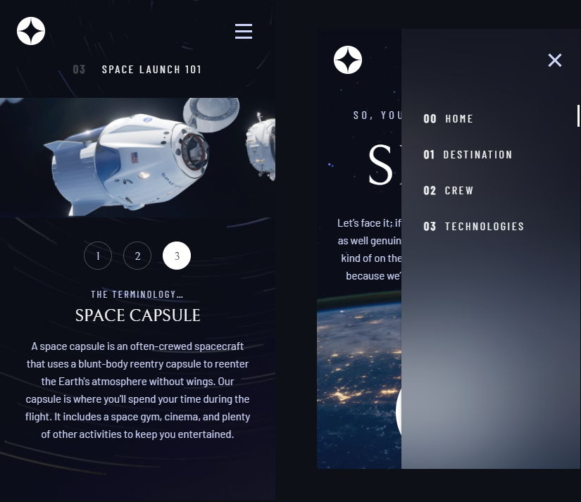

# Frontend Mentor - Space tourism website solution

This is a solution to the [Space tourism website challenge on Frontend Mentor](https://www.frontendmentor.io/challenges/space-tourism-multipage-website-gRWj1URZ3). Frontend Mentor challenges help you improve your coding skills by building realistic projects. 

## Table of contents

- [Overview](#overview)
  - [The challenge](#the-challenge)
  - [Screenshot](#screenshot)
  - [Links](#links)
- [My process](#my-process)
  - [Built with](#built-with)
- [Author](#author)
- [Acknowledgments](#acknowledgments)

## Overview

### The challenge

Users should be able to:

- View the optimal layout for each of the website's pages depending on their device's screen size
- See hover states for all interactive elements on the page
- View each page and be able to toggle between the tabs to see new information

### Screenshot
#### Desktop  

#### Tablet  

#### Mobile  

### Links

- [Solution URL](https://www.frontendmentor.io/solutions/space-tourism-website-with-vuejs-TDX-JnQu9)
- [Live Site URL](https://charlottesaidi.github.io/space-travel)

## My process

### Built with

- MaterializeCss + CSS custom properties
- Flexbox
- Vanilla Javascript
- [VueJs](https://vuejs.org/) - JS framework

## Author

- Frontend Mentor - [@aliseth](https://www.frontendmentor.io/profile/charlottesaidi)
- [Linkedin](https://www.linkedin.com/in/charlotte-saidi/)
